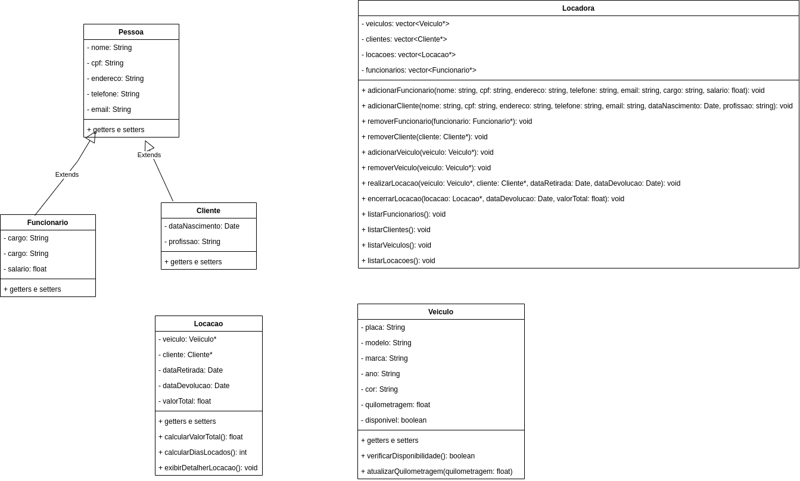

# Locadora de Automóveis

Este é um projeto de uma locadora de automóveis implementado em C++. O sistema permite gerenciar clientes, funcionários, veículos e locações.

## Funcionalidades

O sistema oferece as seguintes funcionalidades:

- Cadastro de clientes, funcionários e veículos.
- Consulta de informações de clientes, funcionários e veículos.
- Realização de locações de veículos.
- Verificação da disponibilidade de veículos.
- Atualização da quilometragem dos veículos.
- Listagem de todas as locações ativas.
- Utilização de estruturas de dados como pilha e fila.
- Implementação dos algoritmos de ordenação Bubble Sort, Quick Sort e Merge Sort.


## Estrutura do projeto

O projeto é modularizado com a seguinte estrutura:

```
projeto
├── bin
├── build
├── data
│   ├── dados.txt
├── docs
│   ├── Doxyfile
├── images
├── include
│   ├── Cliente.h 
│   ├── Funcionario.h
│   ├── HistoricoLocacoes.h
│   ├── Locacao.h
│   ├── Locadora.h
│   ├── OrdenaVeiculo.h
│   ├── Pessoa.h
│   ├── Pilha.h
│   ├── Veiculo.h
│   └── Locadora.h
└── src
│   ├── Cliente.cpp 
│   ├── Funcionario.cpp
│   ├── HistoricoLocacoes.cpp
│   ├── Locacao.cpp
│   ├── Locadora.cpp
│   ├── main.cpp
│   ├── OrdenaVeiculo.cpp
│   ├── Pessoa.cpp
│   ├── Pilha.cpp
│   ├── Veiculo.cpp
│   └── Locadora.cpp

```

- O diretório `bin` contém o arquivo executável `locadora`.
- O diretório `build` contém os arquivos objeto (`.o`) gerados durante a compilação.
- O diretório `data` contém o arquivo `dados.txt` que armazena os dados de clientes, funcionários e veículos.
- O diretório `docs` contém o arquivo `Doxyfile` que é utilizado para gerar a documentação do projeto.
- O diretório `images` contém as imagens utilizadas na documentação do projeto.
- O diretório `include` contém os arquivos de cabeçalho (`.h`) de todas as classes.
- O diretório `src` contém os arquivos de implementação (`.cpp`) de todas as classes, incluindo o arquivo `main.cpp` que contém a função `main`.
- O arquivo `Locadora.cpp` contém a implementação das funções e métodos principais do sistema.

## Compilação e execução

Para compilar o projeto, execute o comando `make` no diretório raiz do projeto. Isso irá gerar o executável `locadora` na pasta `bin`.

Após a compilação bem-sucedida, você pode executar o programa digitando `./bin/locadora` no terminal.

## Estruturas de Dados Utilizadas

O projeto utiliza as seguintes estruturas de dados:

### Pilha

Uma pilha é uma estrutura de dados baseada no princípio LIFO (Last-In, First-Out), em que o último elemento inserido é o primeiro a ser removido. A pilha é utilizada no projeto para manter o histórico de locações de veículos, permitindo o acesso ao último registro de locação realizado. A implementação de pilha utilizada no projeto segue o conceito de uma pilha com operações de inserção (push), remoção (pop) e acesso ao elemento do topo (top).

### Fila

Uma fila é uma estrutura de dados baseada no princípio FIFO (First-In, First-Out), em que o primeiro elemento inserido é o primeiro a ser removido. A fila é utilizada no projeto para gerenciar a fila de espera para locações de veículos. Cada solicitação de locação é adicionada ao final da fila e é processada conforme a ordem de chegada. A implementação de fila utilizada no projeto inclui operações de inserção (push), remoção (pop) e acesso ao elemento da frente (front).

## Algoritmos de Ordenação

O projeto implementa os seguintes algoritmos de ordenação:

### Bubble Sort

O Bubble Sort é um algoritmo de ordenação simples que percorre repetidamente a lista a ser ordenada, comparando elementos adjacentes e trocando-os se estiverem na ordem errada. Esse processo é repetido até que a lista esteja completamente ordenada. O Bubble Sort é eficiente para pequenas listas ou quando a lista já está parcialmente ordenada, mas pode ser menos eficiente para listas maiores. Em seu pior cenário, bem como em seu cenário mediano, o Bubble Sort tem uma complexidade O(n2), em que "n" são os itens a serem ordenados. Dessa forma, é considerado um algoritmo lento em comparação a outros existentes, por isso é raramente utilizado em termos práticos.

### Quick Sort

O Quick Sort é um algoritmo de ordenação eficiente e amplamente utilizado. Ele seleciona um elemento como pivô e particiona a lista em duas partes, uma contendo elementos menores que o pivô e outra contendo elementos maiores. Em seguida, o processo é repetido recursivamente nas duas partes até que toda a lista esteja ordenada. O Quick Sort é eficiente para listas grandes e possui um desempenho médio rápido, haja vista sua complexidade O(n*log n), em que "n" são os itens a serem ordenados, considerando seu cenário mediano, e O(n2) para seu pior cenário.


### Merge Sort

O Merge Sort é um algoritmo de ordenação altamente eficiente e veloz. Tomando um conjunto de n elementos ordenáveis, este algoritmo irá dividi-lo pela metade (n/2) e efetuar sucessivas divisões, também pela metade, desse agrupamento até que esse conjunto se transforme em um conjunto unitário (n/n). A partir daí, o algoritmo passa a reagrupar os elementos (merge) em pares até retornarem ao conjunto original n, mas dessa vez completamente ordenado. Tratando de complexidade, este algoritmo possui a peculiaridade de ser O(n log n), em que "n" são os itens a serem ordenados, nos três casos possíveis: pior, mediano e melhor. 
## Abaixo segue o diagrama de classes do projeto:


